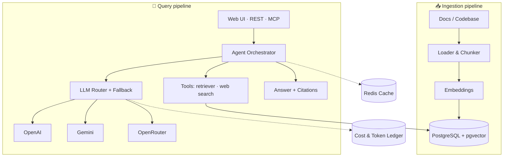

<div align="center">

# 🧭 docent

**Agentic RAG over your docs and code — grounded answers with citations, multi-provider fallback, cost tracking, and native MCP support.**


</div>

---

## What is docent?

A **docent** is the expert guide who walks you through a collection and answers your questions about it. This project does the same for **technical documentation and codebases**: point it at a set of docs or a repository, and it becomes an AI assistant you can query through a **REST API**, a **web UI**, or **directly inside Claude / Cursor** via the **Model Context Protocol (MCP)**.

Unlike a typical demo chatbot, `docent` is built like a real backend service, in **TypeScript / Nest.js**, with the engineering concerns that matter in production:

- 🔀 **Multi-provider LLM routing with fallback** (OpenAI, Gemini, OpenRouter)
- 💰 **Per-request cost & token accounting**
- 🧪 **An automated evaluation suite** that measures answer *faithfulness* and *cost* across models
- 🔌 **A native MCP server**, so it plugs into agentic IDEs and assistants

> 🚧 **Status: early development.** This README describes the target design. See the [Roadmap](#roadmap) for what is built vs. planned.

---

## Why docent

| | |
|---|---|
| 📚 **Grounded, not guessing** | Every answer cites the exact source chunks it used. If there is no relevant context, it says so instead of hallucinating. |
| 🤖 **Agentic retrieval** | The model uses tools in multiple steps (search, fetch, plan) instead of a single naive lookup. |
| 🔀 **Resilient by design** | If a provider fails or times out, requests fall back down a configurable chain. No single point of failure. |
| 💰 **Cost-aware** | Tokens and USD cost are tracked per request, so you can answer "which model is best for *this* task, and at what price?". |
| 🧪 **Measurable quality** | A reproducible eval suite scores retrieval hit-rate, faithfulness and relevance — and compares models head to head. |
| 🔌 **MCP-native** | Runs as an MCP server, usable as a tool inside Claude Desktop / Cursor. |

---

## Architecture



**Ingestion** turns sources into searchable knowledge: load → chunk (code-aware) → embed → store in `pgvector`.
**Query** answers a question: the agent plans, retrieves relevant chunks, calls an LLM (with fallback), and returns a grounded answer with citations — while cost and tokens are logged.

---

## Tech stack

- **Runtime / framework:** Node.js 24 LTS · TypeScript (strict) · Nest.js
- **Storage / vectors:** PostgreSQL + pgvector · Redis (cache)
- **LLM access:** OpenAI-compatible SDKs · OpenRouter
- **Agent tooling / MCP:** `@modelcontextprotocol/sdk`
- **Evaluation:** promptfoo + LLM-as-judge
- **Infra:** Docker · docker-compose · GitHub Actions (CI)

---

## Getting started

**Requirements:** Node **24 LTS** (pinned in `.nvmrc`) and Docker.

```bash
git clone https://github.com/athosmartinez/docent.git
cd docent

nvm use                       # Node 24 — other majors will fail in confusing ways

cp .env.example .env          # database and redis connection strings
docker compose up -d          # PostgreSQL + pgvector + Redis

npm install
npm run migrate
npm run start:dev             # API on http://localhost:3000
```

Verify it came up:

```bash
curl localhost:3000/health
```

Terminus reports `status`, `info`, `error` and `details` — `error` and `details` are present (as `{}` / mirrored `info`) even when everything is healthy:

```json
{
  "status": "ok",
  "info": {
    "database": { "status": "up" },
    "redis": { "status": "up" }
  },
  "error": {},
  "details": {
    "database": { "status": "up" },
    "redis": { "status": "up" }
  }
}
```

> 🚧 Planned — ingestion (M1) and querying (M2) are not implemented yet.

```bash
# ingest a documentation folder or a git repo
curl -X POST localhost:3000/ingest -d '{ "source": "https://github.com/some/library" }'

# ask, and get an answer with citations
curl -X POST localhost:3000/ask -d '{ "question": "How do I configure retries?" }'
```

### Using docent inside Claude / Cursor (MCP)

> 🚧 Planned — the MCP server exposes `search_kb`, `fetch_document` and `ask` as tools.

---

## Evaluation

The differentiator: `docent` ships with a **reproducible evaluation harness**, not just a demo.

- A curated **Q&A dataset** over the ingested corpus
- Automated metrics: **retrieval hit-rate**, **faithfulness** (is the answer grounded in retrieved context?), **answer relevance**, plus **latency and cost**
- **LLM-as-judge** for the qualitative metrics
- A results table committed to the repo, **comparing models and providers** (quality × cost)

This makes it possible to answer, with numbers, *which* model and retrieval strategy is best for a given corpus.

---

## Roadmap

- [x] **M0 — Bootstrap & infra** (Nest scaffold, docker-compose, config, CI skeleton, health check)
- [ ] **M1 — Ingestion pipeline** (loaders, code-aware chunking, embeddings, pgvector store)
- [ ] **M2 — Core RAG** (retriever, grounded answers with citations, streaming, minimal UI)
- [ ] **M3 — Production engine** (multi-provider router + fallback, cost/token ledger, caching)
- [ ] **M4 — Agentic layer** (tool calling, multi-step planning, anti-hallucination guardrails)
- [ ] **M5 — MCP server** (stdio + HTTP, tools exposed, Claude/Cursor integration)
- [ ] **M6 — Evaluation suite** (dataset, metrics, LLM-as-judge, model comparison table)
- [ ] **M7 — Polish & launch** (tests, CI, Docker, demo deploy, docs)

---

## License

[MIT](./LICENSE) © Athos Martinez Andrade
