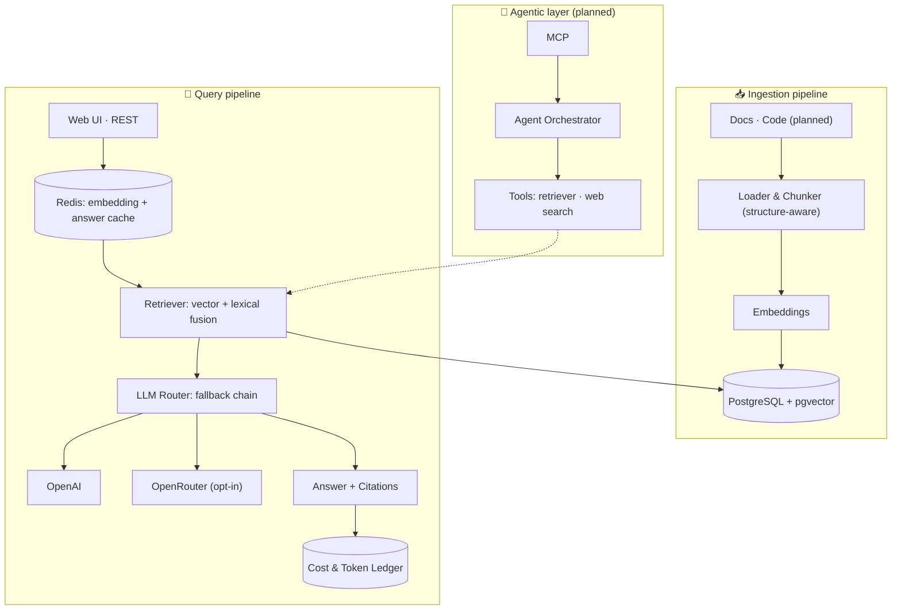

<div align="center">

# 🧭 docent

**Agentic RAG over your documentation, built as a real backend service — ingestion, grounded answers with citations, multi-provider fallback, cost tracking, caching and rate limiting are live today; the evaluation suite and native MCP support are the target design.**


</div>

---

## What is docent?

A **docent** is the expert guide who walks you through a collection and answers your questions about it. This project does the same for **technical documentation**: point it at a set of docs — a folder or a git repository of markdown — and it becomes an AI assistant you can query through a **REST API**, a **web UI**, or **directly inside Claude / Cursor** via the **Model Context Protocol (MCP)**. Ingesting **source code** the same way — chunked by AST rather than treated as prose — is planned for **M6.5**.

Unlike a typical demo chatbot, `docent` is built like a real backend service, in **TypeScript / Nest.js**, with the engineering concerns that matter in production:

- 🔀 **Multi-provider LLM routing with fallback** (OpenAI · OpenRouter)
- 💰 **Per-request cost & token accounting**, aggregated at `GET /costs`
- 🚦 **Redis-backed rate limiting and caching**, so a repeated question costs nothing
- 🧪 **An automated evaluation suite** that measures answer *faithfulness* and *cost* across models
- 🔌 **A native MCP server**, so it plugs into agentic IDEs and assistants

> 🚧 **Status: early development.** This README describes the target design. See the [Roadmap](#roadmap) for what is built vs. planned.

---

## Why docent

| | |
|---|---|
| 📚 **Grounded, not guessing** | Every answer cites the exact source chunks it used, retrieved by fusing a vector search and a full-text search over the corpus. When nothing retrieved is close enough to the question, it refuses instead of guessing — `answer: null`, `citations: []`, `grounded: false` — without ever calling the LLM. The distance threshold is measured against the corpus, not chosen by hand. |
| 🤖 **Agentic retrieval** *(planned)* | The model will use tools in multiple steps (search, fetch, plan) instead of a single naive lookup. |
| 🔀 **Resilient by design** | A completion is routed down a configurable provider chain, one link at a time; on any failure it falls through to the next link, attributing each failure to the link that produced it, and refuses to repeat a `provider:model` pair. The chain ships with a single OpenAI link by default — a fresh clone only needs `OPENAI_API_KEY` — and a second, OpenRouter, link is opt-in via `LLM_CHAIN` (see `.env.example`). |
| 💰 **Cost-aware** | Every *answered* question writes a row to a cost ledger — tokens, USD cost when the model is in the price table, which link answered and why. A refusal never calls a model, so it writes no ledger row (the question and its refusal are still recorded elsewhere) — and `GET /costs?from&to` aggregates the ledger over a time window, by provider and model. |
| 🚦 **Rate limited & cached** | Redis-backed per-client-address limits protect `/ask`, `/ask/stream` and `/ingest` from a single caller monopolising the service; a question-embedding cache and a corpus-versioned answer cache mean an already-answered question costs nothing and answers instantly the second time. |
| 🧪 **Measurable quality** *(planned)* | A reproducible eval suite will score retrieval hit-rate, faithfulness and relevance — and compare models head to head. |
| 🔌 **MCP-native** *(planned)* | Will run as an MCP server, usable as a tool inside Claude Desktop / Cursor. |

---

## Architecture



**Ingestion** turns sources into searchable knowledge: load → chunk (structure-aware: headings, fenced code and tables are never split) → embed → store in `pgvector`.
**Query** answers a question today by checking the answer cache, retrieving relevant chunks (fused vector + full-text search) with their own embedding cache, routing the completion down a fallback-capable provider chain, and returning a grounded answer with citations — recording cost and token usage to a ledger, or declining when nothing retrieved is close enough. The agent loop is still ahead.

---

## Tech stack

- **Runtime / framework:** Node.js 24 LTS · TypeScript (strict) · Nest.js
- **Storage / vectors:** PostgreSQL + pgvector · Redis (cache, rate limiting)
- **LLM access:** OpenAI embeddings (`text-embedding-3-large`) · completions via OpenAI-compatible SDKs, routed through a configurable fallback chain — a single OpenAI link by default, OpenRouter opt-in
- **Agent tooling / MCP:** `@modelcontextprotocol/sdk`
- **Evaluation:** promptfoo + LLM-as-judge
- **Infra:** Docker · docker-compose · GitHub Actions (CI)

---

## Getting started

**Requirements:** Node **24 LTS** (pinned in `.nvmrc`) and Docker.

```bash
git clone https://github.com/athosmartinez/docent.git
cd docent

nvm use                       # Node 24 — other majors will fail in confusing ways

cp .env.example .env          # database and redis connection strings
docker compose up -d          # PostgreSQL + pgvector + Redis

npm install
npm run migrate
npm run start:dev             # API on http://localhost:3000
```

`docker-compose.yml`'s Redis caps itself at `--maxmemory 256mb --maxmemory-policy
allkeys-lru`, so once full it evicts the least-recently-used key instead of refusing
writes — every key this service keeps in Redis (the embedding cache, the answer
cache, rate-limit counters) already carries a TTL, so eviction never throws away
anything that was not already going to expire on its own. **That is local/CI
configuration only.** A production Redis, or any Redis this service does not start
itself, needs its operator to set an equivalent `maxmemory`/`maxmemory-policy`
independently — nothing in this application configures a Redis server it did not
launch, and the default `noeviction` policy makes a full Redis refuse writes instead,
which silently disables the rate limiter (see `src/common/throttling/redis-throttler.storage.ts`).

Verify it came up:

```bash
curl localhost:3000/health
```

Terminus reports `status`, `info`, `error` and `details` — `error` and `details` are present (as `{}` / mirrored `info`) even when everything is healthy:

```json
{
  "status": "ok",
  "info": {
    "database": { "status": "up" },
    "redis": { "status": "up" }
  },
  "error": {},
  "details": {
    "database": { "status": "up" },
    "redis": { "status": "up" }
  }
}
```

Ingest a documentation source:

```bash
npm run ingest -- https://github.com/nestjs/docs.nestjs.com --include 'content/**/*.md'
```

or over HTTP, which returns immediately and processes in the background:

```bash
curl -X POST localhost:3000/ingest \
  -H 'content-type: application/json' \
  -d '{ "source": "https://github.com/nestjs/docs.nestjs.com", "include": "content/**/*.md" }'
# { "sourceId": "...", "status": "pending" }

curl localhost:3000/sources/<sourceId>
# { "status": "ready", "document_count": 136, "chunk_count": 839, ... }
```

> **Known limitation:** ingestion runs in-process. If the service is interrupted
> mid-run, the source is protected by a lease that expires after 15 minutes — after
> that, a new run may reclaim it. A durable queue is not yet built.

Ask a question about the ingested corpus:

```bash
curl -X POST localhost:3000/ask \
  -H 'content-type: application/json' \
  -d '{ "question": "What options does ValidationPipe accept?" }'
```

```json
{
  "answer": "The `ValidationPipe` accepts the following options as configuration, which are derived from both the `ValidationPipeOptions` interface and the `class-validator` ValidatorOptions interface:\n\n- `transform` (boolean): Enables automatic transformation of payloads to DTO class instances.\n- `disableErrorMessages` (boolean): If set to true, detailed validation error messages are disabled in the response.\n- `exceptionFactory` (function): A factory function that takes an array of validation errors and returns an exception object.\n- `errorFormat` ('list' | 'grouped'): Specifies the format of validation error messages....",
  "grounded": true,
  "citations": [
    { "ordinal": 1, "chunkId": "9dea1116-5fbb-491b-ace9-e75083a79914", "path": "content/techniques/validation.md", "headingPath": ["Validation", "Stripping properties"], "score": 0.032266458495966696 },
    { "ordinal": 2, "chunkId": "d78e391d-cf77-4dd6-9acf-3cf4fc5b1713", "path": "content/techniques/validation.md", "headingPath": ["Validation", "Using the built-in ValidationPipe"], "score": 0.032018442622950824 },
    { "ordinal": 3, "chunkId": "555988a9-714a-4ca1-a2e3-bcf69605e574", "path": "content/techniques/validation.md", "headingPath": ["Validation", "Auto-validation"], "score": 0.030309988518943745 },
    { "ordinal": 4, "chunkId": "2f136cd8-df56-419a-a9c9-809f84a021b4", "path": "content/pipes.md", "headingPath": ["Pipes", "Class validator"], "score": 0.028370221327967807 },
    { "ordinal": 5, "chunkId": "124eebb2-a872-421c-8d3f-15569ed4820d", "path": "content/techniques/validation.md", "headingPath": ["Validation", "Transform payload objects"], "score": 0.028309409888357256 },
    { "ordinal": 6, "chunkId": "d06aa196-d602-4a82-8a19-66f7ff109229", "path": "content/pipes.md", "headingPath": ["Pipes", "Transformation use case"], "score": 0.027272727272727275 },
    { "ordinal": 7, "chunkId": "57052851-84f2-44c3-b0e6-87808e6279e1", "path": "content/pipes.md", "headingPath": ["Pipes", "Binding pipes"], "score": 0.026709401709401708 },
    { "ordinal": 8, "chunkId": "9f101f63-83d9-461d-b805-cc8d8c743868", "path": "content/custom-decorators.md", "headingPath": ["Custom route decorators", "Working with pipes"], "score": 0.02581612258494337 }
  ]
}
```

If nothing retrieved is close enough to the question, `docent` refuses instead of guessing — `answer` is `null`, `citations` is `[]`, `grounded` is `false`, and no LLM call is made at all; ask it something the corpus doesn't cover (e.g. "How do I file my taxes in Brazil?") and it declines rather than improvising.

The same question can also be streamed token-by-token over SSE at `POST /ask/stream`, which emits the citations event before the first answer token so a client can render sources while the answer is still arriving.

A minimal chat page that drives both endpoints is served at `http://localhost:3000`.

**Rate limits** protect `/ask` and `/ask/stream` (one shared budget — answering a question is what costs tokens, not which transport asked for it), `/ingest` (tighter still — it spends embeddings and holds a lease) and `/health` (a high ceiling, so a load balancer's own probes don't trip it). All four are per-client-address and configurable — see `THROTTLE_*` in `.env.example`. Past the limit, a request gets `429 Too Many Requests` with a `Retry-After` header; every response also echoes `X-RateLimit-Limit`/`-Remaining`/`-Reset`.

Every *answered* question is priced and logged to a cost ledger; a refusal never calls a model, so it costs nothing and writes no ledger row. `GET /costs` aggregates the ledger over a time window:

```bash
curl localhost:3000/costs
```

```json
{
  "from": null,
  "to": null,
  "totals": {
    "requests": 28,
    "promptTokens": 21996,
    "completionTokens": 2384,
    "cachedTokens": 0,
    "usdCost": 0.00177,
    "unpricedRequests": 4
  },
  "byModel": [
    { "provider": "openai", "model": "gpt-4.1-mini-2025-04-14", "requests": 28, "usdCost": 0.00177, "unpricedRequests": 4 }
  ]
}
```

Accepts `?from=` / `?to=` (ISO 8601, `from` inclusive and `to` exclusive) to aggregate over a window instead of all time. Pricing is looked up by the model each chain link was *configured* with (`LLM_CHAIN`), not by whatever string the provider's response happens to echo as `model` — OpenAI resolves a requested alias to the dated snapshot that actually served it (`gpt-4.1-mini-2025-04-14`) and reports the snapshot, which the ledger's `model` column keeps recording exactly as served; pricing would silently miss on every real call if it looked the snapshot up instead of the configured alias. `unpricedRequests` counts answers where neither the provider reported a cost nor the *configured* model was in the price table — a link genuinely not in `model-prices.ts`, or a completion the provider reported no usage for at all. A repeated question served from the answer cache prices at `usdCost: 0` honestly (`cost_source: "cached"`), never `"unknown"` — it really did cost nothing, unlike an uncosted answer.

### Using docent inside Claude / Cursor (MCP)

> 🚧 Planned — the MCP server exposes `search_kb`, `fetch_document` and `ask` as tools.

---

## Evaluation

> 🚧 Planned (M6) — none of this is implemented yet.

The differentiator: `docent` is designed to ship with a **reproducible evaluation harness**, not just a demo.

- A curated **Q&A dataset** over the ingested corpus
- Automated metrics: **retrieval hit-rate**, **faithfulness** (is the answer grounded in retrieved context?), **answer relevance**, plus **latency and cost**
- **LLM-as-judge** for the qualitative metrics
- A results table committed to the repo, **comparing models and providers** (quality × cost)

This makes it possible to answer, with numbers, *which* model and retrieval strategy is best for a given corpus.

---

## Roadmap

- [x] **M0 — Bootstrap & infra** (Nest scaffold, docker-compose, config, CI skeleton, health check)
- [x] **M1 — Ingestion pipeline** (markdown loader, structure-aware chunking, embeddings, pgvector store)
- [x] **M1.5 — Table handling** (HTML tables converted to markdown, never split across chunks)
- [x] **M2 — Core RAG** (retriever, grounded answers with citations, streaming, minimal UI)
- [x] **M3 — Production engine** (multi-provider router + fallback, cost/token ledger, caching)
- [ ] **M4 — Agentic layer** (tool calling, multi-step planning, anti-hallucination guardrails)
- [ ] **M5 — MCP server** (stdio + HTTP, tools exposed, Claude/Cursor integration)
- [ ] **M6 — Evaluation suite** (dataset, metrics, LLM-as-judge, model comparison table)
- [ ] **M6.5 — Source code ingestion** (chunking by AST, search over literal identifiers)
- [ ] **M7 — Polish & launch** (tests, CI, Docker, demo deploy, docs)

---

## License

[MIT](./LICENSE) © Athos Martinez Andrade
